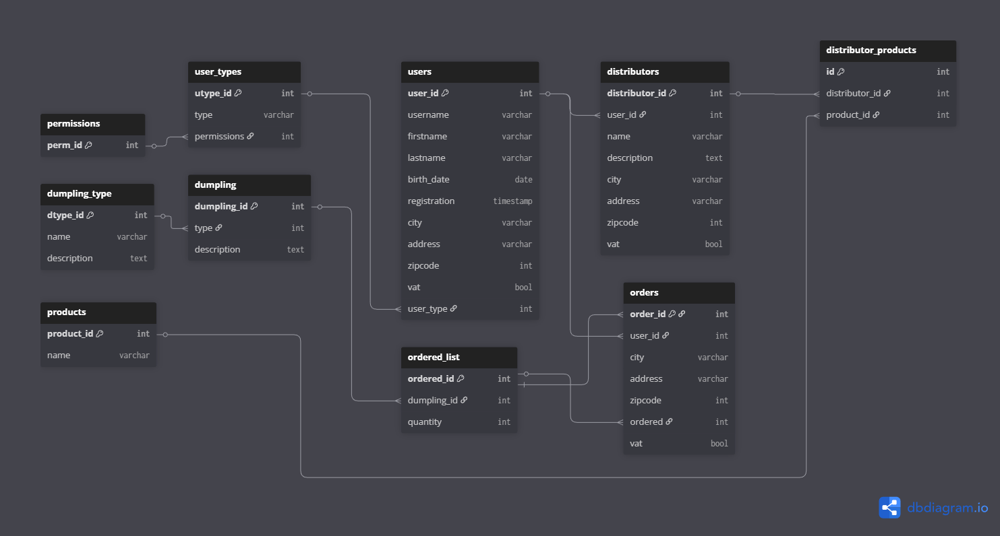

# DBobchodKnedliky

A MySQL database schema for a dumpling store (Knedlík Store) management system. This database handles users, orders, dumplings, distributors, and products.

## Database Schema Diagram



## Tables Overview

### User Management

- **users**: Stores customer and user information including personal details (username, firstname, lastname, birth_date), contact information (city, address, zipcode), registration timestamp, VAT status, and user type reference.
- **user_types**: Defines different types of users (e.g., customer, admin, distributor) with associated permissions.
- **permissions**: Stores permission levels that can be assigned to user types.

### Dumplings (Products)

- **dumpling_type**: Categories/types of dumplings with name and description.
- **dumpling**: Individual dumpling products with reference to their type and description.

### Orders

- **orders**: Customer orders with delivery address (city, address, zipcode), user reference, ordered items reference, and VAT status.
- **ordered_list**: Items within an order, linking to specific dumplings with quantity.

### Distributors

- **distributors**: Business entities that distribute products, linked to user accounts with their own address and VAT information.
- **products**: Products available for distribution.
- **distributor_products**: Junction table linking distributors to the products they offer.

## Relationships

- `users.user_type` → `user_types.utype_id`: Each user has a user type
- `user_types.permissions` → `permissions.perm_id`: Each user type has permission settings
- `dumpling.type` → `dumpling_type.dtype_id`: Each dumpling belongs to a type
- `orders.user_id` → `users.user_id`: Each order belongs to a user
- `orders.ordered` → `ordered_list.ordered_id`: Each order has ordered items
- `ordered_list.dumpling_id` → `dumpling.dumpling_id`: Each ordered item references a dumpling
- `distributors.user_id` → `users.user_id`: Each distributor is linked to a user
- `distributor_products.distributor_id` → `distributors.distributor_id`: Links products to distributors
- `distributor_products.product_id` → `products.product_id`: Links distributors to products

## Files

- `knedlikstore.sql` - Main SQL schema file
- `database_schema.sql` - Copy of the database schema
- `knedlikstore.png` - Visual diagram of the database structure

## Usage

To create the database, run the SQL script in your MySQL environment:

```sql
SOURCE knedlikstore.sql;
```

Or import it using your preferred MySQL client.